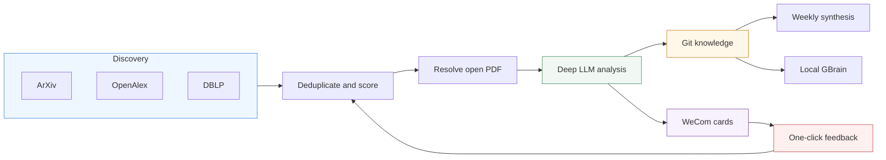

<div align="center">

# AI Research Radar Skill

**Deploy a daily AI research companion for any academic field.**

[**English**](#english) · [**中文**](#中文)

[](https://github.com/peipeijiang/ai-research-radar-skill/actions/workflows/validate.yml)
[](https://agentskills.io/)
[](https://www.python.org/)
[](LICENSE)

</div>

<a id="english"></a>

## What It Deploys

`deploy-ai-research-radar` is an Agent Skill for setting up a complete,
GitHub-hosted paper research workflow. It turns any user-defined field into daily
discovery, PDF-backed analysis, durable knowledge, weekly synthesis, WeCom
delivery, and preference feedback.

The Skill deploys the maintained
[`arxiv-daily-researcher`](https://github.com/peipeijiang/arxiv-daily-researcher)
template and guides an agent through secrets, topic configuration, optional
MinerU/CORE/GBrain integrations, one-click feedback, and production checks.



## Capabilities

| Area | Included |
| --- | --- |
| Discovery | User-defined topics across ArXiv, OpenAlex, optional DBLP venues |
| Understanding | LLM scoring, Chinese summaries, MinerU/PyMuPDF full-text analysis |
| Evidence | Open-access resolution, citation graph, official GitHub code verification |
| Delivery | Daily overview, one complete WeCom card per paper, weekly synthesis |
| Memory | Deduplicated Git knowledge and optional MiniMax-backed GBrain search |
| Feedback | Signed one-click Like/Ignore links with GitHub Issue audit trail |

For papers without a PDF, the deployed pipeline tries an ArXiv DOI/title match,
OpenAlex repository locations, Unpaywall, CORE, and public repository landing
pages before falling back to explicitly labeled abstract-only analysis.

## Quick Start

### 1. Install the Skill

```bash
git clone https://github.com/peipeijiang/ai-research-radar-skill.git
mkdir -p ~/.agents/skills
cp -R ai-research-radar-skill/skills/deploy-ai-research-radar ~/.agents/skills/
```

Then ask your agent:

```text
Use $deploy-ai-research-radar to deploy a private daily research radar for my
field, with my own keywords and ArXiv categories, delivered to WeCom.
```

### 2. Or Run the Deterministic Setup

```bash
SKILL=skills/deploy-ai-research-radar

bash "$SKILL/scripts/bootstrap_repository.sh" \
  --target YOUR_GITHUB_NAME/my-research-radar \
  --visibility private

python "$SKILL/scripts/configure_topics.py" \
  --checkout /path/to/my-research-radar

python "$SKILL/scripts/configure_repo.py" \
  --repo YOUR_GITHUB_NAME/my-research-radar
```

The configuration script sends secrets through stdin to GitHub. It does not
write keys to the repository or a local `.env` file.

### 3. Trigger and Verify

```bash
gh workflow run daily-run.yml \
  --repo YOUR_GITHUB_NAME/my-research-radar \
  -f search_days=7

python "$SKILL/scripts/verify_deployment.py" \
  --repo YOUR_GITHUB_NAME/my-research-radar \
  --require-custom-topics
```

## Configuration

The minimum setup needs one OpenAI-compatible LLM key and a WeCom robot
webhook. An OpenAlex contact email is recommended. DeepSeek is the scripted
default; model and base URL remain configurable.

Optional integrations add structured PDF parsing and broader open-access
coverage:

- **MinerU** for structured PDF extraction
- **CORE** for repository full text
- **Semantic Scholar** for metadata and citation enrichment
- **Cloudflare Worker** for one-click feedback
- **GBrain** for local hybrid and semantic search

The Skill keeps detailed key definitions and troubleshooting in progressive
references, loading them only when needed.

## One-Click Feedback

The deployed Worker serves a signed link that records feedback after one tap.
The landing page automatically sends a POST request, while link-preview GET
requests cannot create Issues. A fine-grained GitHub token should grant only
the target repository and Issues read/write.

```bash
GITHUB_ISSUES_TOKEN=github_pat_... \
bash "$SKILL/scripts/deploy_feedback_worker.sh" \
  --repo YOUR_GITHUB_NAME/my-research-radar \
  --checkout /path/to/my-research-radar
```

## Skill Layout

- `SKILL.md` contains the deployment decisions and completion contract.
- `scripts/` contains deterministic repository, secret, Worker, and audit tools.
- `references/` contains architecture, configuration, and troubleshooting detail.
- `agents/openai.yaml` provides Codex-compatible UI metadata.

The Skill follows the portable Agent Skills directory format used by current
agent tooling. The maintained reference repositories from
[Anthropic](https://github.com/anthropics/skills) and
[OpenAI](https://github.com/openai/skills) use the same core `SKILL.md` model.

---

<a id="中文"></a>

## 中文

`deploy-ai-research-radar` 是一个可按任意学术领域部署论文研究雷达的
Agent Skill。它先询问用户自己的研究背景、关键词与 ArXiv 分类，再把
ArXiv、OpenAlex、可选 DBLP 的论文发现，LLM 评分、PDF 深读、
GitHub 知识库、企业微信日报、周报、GBrain 检索和一键反馈组合成一套可长期
运行的 GitHub Actions 流程。

### 适合谁

- 希望持续追踪计算机、物理、生物医学或其他学术方向的研究者
- 不想每天手动搜索、下载、阅读和整理论文的个人用户
- 需要保留证据链、代码仓库、引用关系和偏好反馈的研究团队

### 最快安装

```bash
git clone https://github.com/peipeijiang/ai-research-radar-skill.git
mkdir -p ~/.agents/skills
cp -R ai-research-radar-skill/skills/deploy-ai-research-radar ~/.agents/skills/
```

随后对 Agent 说：

```text
使用 $deploy-ai-research-radar，先询问我的研究领域和关键词，再部署一套
每天推送到企业微信的论文研究雷达。
```

### 部署结果

- 每天自动发现、去重和筛选论文
- 优先寻找合法开放 PDF，并执行全文深度分析
- 每篇论文一张完整企业微信卡片，不截断核心内容
- 自动生成适合手机阅读的 Markdown 深度报告
- 每周生成带证据区分的研究综述
- 喜欢/忽略反馈进入下一轮评分
- 可选同步到本地 GBrain，使用 `minimax:embo-01` 等模型检索

### 密钥原则

所有密钥均通过 GitHub Secrets 或 Cloudflare Worker Secrets 保存，不应写入
仓库、日志或聊天记录。一键反馈建议使用只允许目标仓库 Issues 读写的
Fine-grained Token。

## License

This Skill is released under the [MIT License](LICENSE). The deployed
`arxiv-daily-researcher` application remains governed by its own AGPL-3.0
license.
