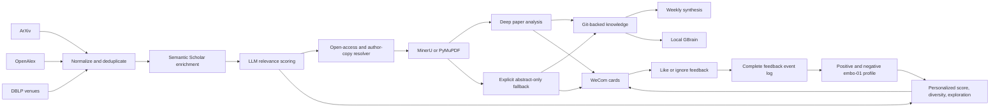

# Architecture

## Data flow

## Component roles

| Component | Responsibility |
| --- | --- |
| ArXiv | Recent preprints, abstracts, canonical PDF access |
| OpenAlex | Broad topic discovery, metadata, citations, related works, OA locations |
| DBLP | Optional venue-focused discovery when the user's field has configured DBLP venues |
| ECB/BIS/Federal Reserve | Official central-bank working-paper RSS with first-party provenance |
| Bank of Canada/EconStor | Official RSS discovery with repository landing pages for PDF recovery |
| World Bank | Official Documents API restricted to Policy Research Working Papers |
| RePEc free series | Current-year catalogs for IMF, BoE, OECD, ADB, IZA, CESifo, and regional Federal Reserve working papers; restricted records are rejected |
| Semantic Scholar | Abstract/TLDR backfill and citation metadata |
| GitHub matching | Verify official or author-linked implementation repositories |
| OpenReview | Exact-title public submissions and lawful PDF recovery |
| Author GitHub PDF | Recover a paper explicitly linked from a title-matched implementation README |
| MinerU | Structured cloud PDF extraction; optional |
| PyMuPDF | Local PDF text fallback |
| Deep LLM | Scoring, translation, deep analysis, weekly synthesis |
| GitHub Actions | Daily and weekly scheduling, secrets, durable execution |
| WeCom | Overview plus one complete card per paper |
| Single-paper reanalysis | Replace an abstract fallback after a verified public PDF is found |
| Feedback Worker | Signed one-click feedback that creates auditable GitHub Issues |
| Personalization engine | Time-decayed positive/negative semantic profile, lexical fallback, diversity reranking, exploration, and recommendation reasons |
| GBrain | Optional local hybrid and semantic search over committed knowledge |

## Durable state

- `knowledge/index.jsonl`: deduplicated machine-readable records.
- `knowledge/papers/`: mobile-friendly Markdown research reports.
- `knowledge/graph.json`: citation and related-work edges.
- `knowledge/feedback.json`: synchronized preferences.
- `knowledge/preferences/events.jsonl`: complete auditable LIKE/IGNORE history.
- `knowledge/preferences/embeddings.jsonl`: cached `embo-01` vectors.
- `knowledge/preferences/profile.json`: deployment-specific preference profile.
- `knowledge/preferences/metrics.jsonl`: shadow/live ranking diagnostics.
- `knowledge/reports/weekly/`: weekly evidence-aware synthesis.

Treat Git as the durable source of truth. GitHub Actions caches are accelerators,
not authoritative storage.

Store `_analysis_basis` as `full_text` or `abstract`. Delivery must expose that
basis: overview counts both classes, and abstract-only cards carry a prominent
warning. The model may summarize an abstract, but it must not invent datasets,
metrics, baselines, or paper limitations absent from the available evidence.
