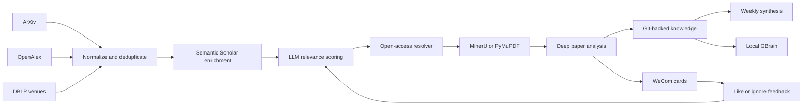

# Architecture

## Data flow

## Component roles

| Component | Responsibility |
| --- | --- |
| ArXiv | Recent preprints, abstracts, canonical PDF access |
| OpenAlex | Broad topic discovery, metadata, citations, related works, OA locations |
| DBLP | Venue-focused discovery for RecSys, SIGIR, WSDM, KDD, WWW, and CIKM |
| Semantic Scholar | Abstract/TLDR backfill and citation metadata |
| GitHub matching | Verify official or author-linked implementation repositories |
| MinerU | Structured cloud PDF extraction; optional |
| PyMuPDF | Local PDF text fallback |
| Deep LLM | Scoring, translation, deep analysis, weekly synthesis |
| GitHub Actions | Daily and weekly scheduling, secrets, durable execution |
| WeCom | Overview plus one complete card per paper |
| Feedback Worker | Signed one-click feedback that creates auditable GitHub Issues |
| GBrain | Optional local hybrid and semantic search over committed knowledge |

## Durable state

- `knowledge/index.jsonl`: deduplicated machine-readable records.
- `knowledge/papers/`: mobile-friendly Markdown research reports.
- `knowledge/graph.json`: citation and related-work edges.
- `knowledge/feedback.json`: synchronized preferences.
- `knowledge/reports/weekly/`: weekly evidence-aware synthesis.

Treat Git as the durable source of truth. GitHub Actions caches are accelerators,
not authoritative storage.
